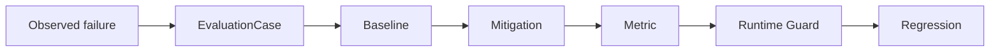

# LLM Evaluation Lab

**Reproducible LLM evaluation harness for failure mechanisms, mitigation experiments, and regression testing.**

[](https://github.com/aerenkolstein-code/llm-evaluation-lab/actions/workflows/test.yml)

## First Closed Loop

| Result | Measured value |
|---|---:|
| Baseline accuracy | 20% |
| With Closure Guard | 100% |
| Known regression failures caught | 4/4 |
| Evaluation tests | 32/32 |
| Container CLI/API smoke | PASS |
| Executable MitigationSpec | Runtime-validated |
| SEARCH-CUP-02 P0/P1/P2 tests | 31/31 |
| Full repository tests | 63/63 |

**Status:** Experimental / reproducible artifact  
**Evidence level:** E3 — reproducible public-safe evaluation



LLM Evaluation Lab proves whether a protection works. The paired [Companion-Mind](https://github.com/aerenkolstein-code/Companion-Mind) repository implements the protection.

`EVAL-CASE-001` reproduces **Premature Parent Closure** across five deterministic, public-safe variants. The harness compares a known-bad baseline with Companion-Mind's `CM-GUARD-001`, records metrics, and deliberately reintroduces the bad policy to prove the regression suite catches the recurrence.

> In the current reproducible first-closed-loop evaluation, the implemented Closure Guard improved the tested cases from 20% baseline accuracy to 100%; broader generalization has not yet been established.

## Historical Failure Benchmark v0.4

The second executable suite compresses longitudinal error observations into a
small mechanism benchmark without publishing the private source material or
encoding one rule per historical correction.

| Benchmark signal | Measured value |
|---|---:|
| Source observations reviewed | 89 |
| Raw failure categories | 18 |
| Mechanism clusters | 12 |
| Synthetic public-safe cases | 24 |
| Confidence-only baseline | 50% |
| Uniform constraint gate | 100% |
| Known-bad traps caught | 12/12 |
| Per-observation rules | 0 |

Each cluster contains a minimal pair: one fluent but structurally invalid `TRAP`
and one matched `CONTROL`. The reference gate accepts only supported candidates
whose explicit constraints all pass. It is the same policy for all 24 cases—there
are no mechanism-specific branches and no 89-item `if/else` table.

These figures describe a deterministic, mechanism-preserving synthetic benchmark.
They do not establish live-model effectiveness, corpus representativeness or
scientific benchmark validity.

## Reproduce

Clone both repositories as siblings. Requires Python 3.11 or later; no model API, network call, or private dataset is used by the experiment.

```bash
python -m pip install -e ../Companion-Mind
python -m pip install -e .
python -m unittest discover -s tests -v
llm-eval --cases cases/anonymized/premature-parent-closure.md
llm-eval \
  --cases cases/anonymized/premature-parent-closure.md \
  --emit-mitigation /tmp/mitigation.json \
  --output /tmp/evaluation.json
llm-eval \
  --suite historical \
  --cases cases/anonymized/premature-parent-closure.md \
  --output /tmp/historical-benchmark.json
companion-mind validate-mitigation --mitigation-spec /tmp/mitigation.json
```

The command validates the public-safe case contract, executes baseline and treatment,
grades every variant, calculates metrics, enforces the regression gate, and emits a
stable JSON or Markdown report. Exit code `1` means regression failure; invalid input
or missing runtime dependencies return `2`.

## Persistent experiment tracking v0.5

Runs can now be written atomically to a dependency-free SQLite store. The store
keeps immutable execution identity, suite version, model/policy, prompt version,
metrics, latency, token cost, git commit, UTC timestamp and the canonical result
JSON. A duplicate `run_id` is rejected instead of silently overwriting evidence.

```bash
llm-eval \
  --suite historical \
  --cases cases/anonymized/premature-parent-closure.md \
  --store /tmp/eval-runs.sqlite3 \
  --model deterministic-reference \
  --prompt-version hfb-v1 \
  --git-commit "$(git rev-parse HEAD)" \
  --log-json \
  --output /tmp/historical-run.json

llm-eval \
  --store /tmp/eval-runs.sqlite3 \
  --list-runs 10
```

Structured lifecycle events are emitted to `stderr`, leaving the JSON or
Markdown report on `stdout` or in `--output`. SQLite files are runtime evidence
and are ignored by git; they are not checked into the public repository.

## Read-only query API v0.6

An optional FastAPI surface exposes the immutable experiment store without
adding any write route. It binds to loopback by default and opens SQLite with
`mode=ro` plus `PRAGMA query_only=ON`.

```bash
llm-eval-api --store /tmp/eval-runs.sqlite3

curl http://127.0.0.1:8000/healthz
curl 'http://127.0.0.1:8000/v1/runs?limit=10'
curl http://127.0.0.1:8000/v1/runs/RUN-ID
```

The list endpoint returns indexed metadata only. The detail endpoint returns one
stored public-safe canonical result. There is no create, update or delete API,
no authentication layer, and no claim that this local demonstration is ready for
network or production exposure.

## Docker reproducibility (introduced in v0.7)

The repository includes one minimal Dockerfile. It pins the Companion-Mind runtime
to commit `c6a2128271532746a5570b99ce0ccdea4618db4e`, installs the evaluation
package, and runs as an unprivileged user.

```bash
docker build -t llm-evaluation-lab:0.10 .

docker run --rm llm-evaluation-lab:0.10 \
  --suite historical \
  --cases cases/anonymized/premature-parent-closure.md
```

To query a previously created store, mount it read-only and publish only to host
loopback:

```bash
docker run --rm \
  -p 127.0.0.1:8000:8000 \
  -v /absolute/path/to/data:/data:ro \
  --entrypoint llm-eval-api \
  llm-evaluation-lab:0.10 \
  --store /data/eval-runs.sqlite3 \
  --host 0.0.0.0 \
  --allow-network
```

CI builds the image from a clean checkout, verifies version `0.10.0`, executes the
24-case historical regression, creates a mounted SQLite record, then queries the
containerized API over HTTP. This is reproducible local packaging, not a published
registry image or production deployment.

## SEARCH-CUP-02 Four Provider Adapters v0.10

`ENG-SC-01-P0` added a closed-book, provider-neutral search-benchmark skeleton.
The P0 regression remains intentionally offline: four deterministic fake entrants receive the same
canonical Candidate Card and CompetitionSpec; each gets an isolated search tool
with a hard 20-call budget; submissions are frozen and SHA-256 hashed before a
synthetic hidden registry can be opened; the judge then produces a deterministic
dimension-preserving scoreboard.

```bash
llm-search-cup preflight
llm-search-cup demo --format markdown
```

`ENG-SC-01-P1` adds exactly one live infrastructure boundary: Zhipu Web Search
API with `search_engine=search_pro`. It normalizes official `title`, `link`, and
`content` fields into the same `SearchResult` contract used by every future
provider adapter. The backend performs no automatic retry: a caller retry is a
new SearchProxy call and therefore a new budget event.

The only live command is a manually gated Fake Entrant smoke with one to three
queries:

```bash
export GLM_API_KEY=...  # keep this outside shell history and repository files
llm-search-cup live-smoke \
  --authorize-live-search-smoke \
  --query 'OpenAI careers evaluation remote Europe' \
  --query 'Anthropic careers model behavior remote Europe' \
  --output /tmp/search-pro-smoke.json
```

The command has no model adapter, Candidate Card handoff, hidden-registry handle,
judge, provider loop, or official-match path. It cannot turn two smoke queries
into the four-model 80-call match. The API key is read only from the named
environment variable and is never included in results, errors, traces, or Git.
Without the explicit authorization flag, the command fails before key lookup or
network access.

P0 evidence:

- call 21 is rejected before the backend executes;
- failed backend attempts consume one explicit budget event;
- all four successful submissions share identical contract fingerprints;
- one provider failure preserves other entrants' frozen evidence;
- hidden-registry access fails until all four submissions are frozen and entrant execution is closed;
- repeated judging is byte-identical and requires no model call;
- Apply-Now errors receive the specified 2× penalty.

P1 evidence:

- one `search_web` invocation creates one trace and consumes one ticket whether
  the backend succeeds, returns HTTP 429, violates its schema, or rejects an
  invalid query;
- traces record entrant, query, call number, normalized result count, backend and
  request identity, HTTP/error fields, duration, and an explicit zero automatic
  retry count;
- the 21st call remains rejected before any backend execution;
- P0 hidden-registry isolation, provider failure isolation, freeze/hash, and
  deterministic judging remain green;
- all four P2 provider adapters receive the same `EntrantTools.search_web` and
  `SearchResult` contract.

`ENG-SC-01-P2` adds four protocol adapters—OpenAI Chat Completions, Gemini
`generateContent`, DeepSeek Chat Completions, and GLM Chat Completions—without
adding a match runner, hidden judge, or official prompt path. The manually gated
smoke executes providers sequentially and gives each a fresh one-ticket
SearchProxy:

```bash
export OPENAI_API_KEY=...
export GEMINI_API_KEY=...
export DEEPSEEK_API_KEY=...
export GLM_API_KEY=...  # also used by search_pro unless overridden
llm-search-cup p2-smoke \
  --authorize-p2-provider-smoke \
  --output /tmp/p2-provider-smoke.json
```

Every provider receives the same Candidate Card bytes, non-official smoke
instruction, `search_web` description/schema, normalized results, and final
`Submission` contract. Evidence records requested/resolved model IDs, endpoint
mode, sampling configuration, model attempts, SearchProxy traces, and Submission
contract hashes. There is no automatic retry. Credential, provider, network,
tool, or schema failures are typed `NOT_EVALUABLE` with `quality_score: null`.
The command does not load the official task, private registry, or judge and does
not authorize P3-P5 or the 80-call match.

## Executable integration v0.3

The experiment now owns a complete `mitigation-spec/v1` contract, validates it,
emits canonical JSON, and instantiates Companion-Mind's real `ClosureGuard` from
that document. The evaluation report records the runtime-loaded mitigation ID,
safeguard ID, schema version, and canonical SHA-256 fingerprint. This makes the
boundary explicit: Eval Lab specifies and verifies; Companion-Mind implements.

## Evidence boundary

### Implemented

- dependency-free `llm-eval` CLI and deterministic evaluation harness;
- validated public-safe `EvaluationCase` loader;
- validated and emitted executable `MitigationSpec`;
- real Companion-Mind runtime loading with shared spec fingerprint;
- baseline and mitigation comparison;
- accuracy and premature-closure metrics;
- JSON and Markdown report output;
- checked result artifact and known-bad regression gate.
- validated 12-cluster, 24-case Historical Failure Benchmark;
- one uniform evidence-and-constraint gate with zero per-observation rules.
- immutable SQLite experiment-run persistence and metadata query;
- structured JSON lifecycle logging.
- loopback-first read-only FastAPI health, list and detail endpoints.
- non-root Docker packaging with pinned Companion-Mind runtime commit.

### Measured in the current demonstration

- baseline accuracy: **20%**;
- guarded accuracy: **100%**;
- premature closure rate: **100% → 0%**;
- known recurrence variants caught: **4/4**;
- runtime integration status: **PASS**.
- historical benchmark baseline: **50%**;
- uniform constraint gate: **100%**;
- historical traps caught: **12/12**;
- evaluation tests: **32/32**;
- SQLite persistence and readback: **PASS**;
- duplicate run protection: **PASS**.
- API route write methods exposed: **0**;
- read-only query mutation check: **PASS**.
- Docker image build: **PASS**;
- containerized CLI/API smoke: **PASS**.

### Not claimed

- production deployment;
- broad model generalization;
- scientific benchmark validity;
- enterprise-grade reliability;
- live-LLM effectiveness or statistical significance.
- authenticated or production-ready API deployment.
- bit-for-bit dependency or base-image reproducibility.

## Artifact map

- `evaluation_lab.py` — loader, policies, grader, metrics, regression gate, CLI, and read-only API
- `search_cup/` — P0 contracts, P1 `search_pro`, and gated P2 provider adapters; the offline runner/judge remain isolated
- `candidates/` and `competitions/` — canonical public-safe P0 inputs and fingerprints
- `cases/anonymized/premature-parent-closure.md` — first-loop case card plus executable 24-case historical benchmark
- `experiments/closure-guard-mitigation.md` — mitigation, decision rule, and executable JSON contract
- `results/EVAL-CASE-001.json` — checked deterministic result
- `tests/test_evaluation.py` — loader, reproducibility, reporting, and regression assertions
- `schemas/` — shared evaluation and mitigation contracts
- `Dockerfile` — non-root container build for CLI and read-only API reproduction

## Roadmap

**SEARCH-CUP-02 P2 implemented; P3-P5 locked** — the offline fairness harness,
unified real-search boundary, and four provider protocol adapters are
implemented. Runner/evidence automation, the private judge snapshot, preflight,
and any official 80-call match remain separate Board-gated phases under Issue #8.

## Privacy

The fixtures preserve failure mechanisms without publishing the private scenes that revealed them. The historical suite uses synthetic neutral scenarios and excludes source quotations and archive locators. The repository contains no private Raw/L0 material, credentials, account data, client documents, personal records, or links to private archives.

The API returns whatever canonical result was stored by the operator. Only
public-safe runs belong in a publicly reachable deployment; this artifact binds
to localhost by default and intentionally provides no authentication.
