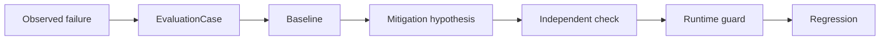

# LLM Evaluation Lab

**Reproducible evaluation lab for failure mechanisms, mitigation experiments, regression testing, independent system gates, and longitudinal evidence.**

[](https://github.com/aerenkolstein-code/llm-evaluation-lab/actions/workflows/test.yml)

## Current evaluation focus

LLM Evaluation Lab is the **A2 / Measure the system** repository. It is not a QA annex that lets one product grade itself. Its job is to turn observed AI-system failures and continuity claims into reproducible cases, explicit oracles, comparative evidence, falsifiable mitigation hypotheses, and regression gates.

The paired [Companion-Mind](https://github.com/aerenkolstein-code/Companion-Mind) repository is the A1 / implementation counterpart:

> **A1 builds the system. A2 measures whether it actually improves.**

The current product-linked evaluation gate is **A019 / Gate E1 — Durable Journal black-box evaluation**. The published A2 Wave 1 plan defines durability, ordering, dedupe, crash/restart recovery, correction, secret exclusion, and UNKNOWN semantics as zero-tolerance observable invariants. The plan is published; implementation and Gate E1 execution remain separately gated and wait for an A1-D candidate and sanctioned black-box seam.

After E1, the product-linked evaluation path follows the current personal-first runtime sequence:

```text
Journal / E1
→ Context Engine / Owned Home
→ Retrieval / Authority Routing
→ Model Gateway / model-switch continuity
→ W1 operational independence
→ Living Lab longitudinal reliability
→ W2 evidence readiness
```

This does **not** pre-select a commercial companion product. Commercial evaluation becomes relevant only if later product discovery explicitly extracts one from long-term use evidence.

The broader lab now has four connected lanes:

1. **Failure Mechanism Lab** — failure taxonomy, mechanism clustering, reproducible cases, baseline/treatment, falsification, and regression.
2. **A2 Independent System Gates** — black-box evidence for A1/runtime promises without copying A1 implementation authority.
3. **RAW Harvest + Historical / Era Benchmarks** — private longitudinal evidence is mined into public-safe mechanisms, replay cases, rubrics, and cross-generation comparisons; private Raw/L0 stays private.
4. **Longitudinal Cognitive / Persona Research** — concept growth, reasoning trajectory, world-model evolution, personality/relationship continuity, prior lock-in, attractor stability, replay effects, and related long-horizon questions when evidence and protocol are mature enough.

See [docs/current-roadmap.md](docs/current-roadmap.md), [docs/methodology.md](docs/methodology.md), and [docs/method-lineage.md](docs/method-lineage.md).

The `main` branch below remains the stable public evidence base for the First Closed Loop, Historical Failure Benchmark, immutable experiment tracking, read-only query API, and Docker reproducibility.

**B / Search Cup** is a separate Search/Tooling workstream that also lives in this repository for infrastructure reuse. Repository location does not make Search Cup part of A2, and its later live/provider phases remain separately gated.

## First Closed Loop

| Result | Measured value |
|---|---:|
| Baseline accuracy | 20% |
| With Closure Guard | 100% |
| Known regression failures caught | 4/4 |
| Evaluation tests | 32/32 |
| Container CLI/API smoke | PASS |
| Executable MitigationSpec | Runtime-validated |

**Status:** Experimental / reproducible artifact  
**Evidence level:** E3 — reproducible public-safe evaluation



LLM Evaluation Lab proves whether a protection works. The paired [Companion-Mind](https://github.com/aerenkolstein-code/Companion-Mind) repository implements the protection.

`EVAL-CASE-001` reproduces **Premature Parent Closure** across five deterministic, public-safe variants. The harness compares a known-bad baseline with Companion-Mind's `CM-GUARD-001`, records metrics, and deliberately reintroduces the bad policy to prove the regression suite catches the recurrence.

> In the current reproducible first-closed-loop evaluation, the implemented Closure Guard improved the tested cases from 20% baseline accuracy to 100%; broader generalization has not yet been established.

## Historical Failure Benchmark v0.4

The second executable suite compresses longitudinal error observations into a
small mechanism benchmark without publishing the private source material or
encoding one rule per historical correction.

| Benchmark signal | Measured value |
|---|---:|
| Source observations reviewed | 89 |
| Raw failure categories | 18 |
| Mechanism clusters | 12 |
| Synthetic public-safe cases | 24 |
| Confidence-only baseline | 50% |
| Uniform constraint gate | 100% |
| Known-bad traps caught | 12/12 |
| Per-observation rules | 0 |

Each cluster contains a minimal pair: one fluent but structurally invalid `TRAP`
and one matched `CONTROL`. The reference gate accepts only supported candidates
whose explicit constraints all pass. It is the same policy for all 24 cases—there
are no mechanism-specific branches and no 89-item `if/else` table.

These figures describe a deterministic, mechanism-preserving synthetic benchmark.
They do not establish live-model effectiveness, corpus representativeness or
scientific benchmark validity.

## Reproduce

Clone both repositories as siblings. Requires Python 3.11 or later; no model API, network call, or private dataset is used by the experiment.

```bash
python -m pip install -e ../Companion-Mind
python -m pip install -e .
python -m unittest discover -s tests -v
llm-eval --cases cases/anonymized/premature-parent-closure.md
llm-eval \
  --cases cases/anonymized/premature-parent-closure.md \
  --emit-mitigation /tmp/mitigation.json \
  --output /tmp/evaluation.json
llm-eval \
  --suite historical \
  --cases cases/anonymized/premature-parent-closure.md \
  --output /tmp/historical-benchmark.json
companion-mind validate-mitigation --mitigation-spec /tmp/mitigation.json
```

The command validates the public-safe case contract, executes baseline and treatment,
grades every variant, calculates metrics, enforces the regression gate, and emits a
stable JSON or Markdown report. Exit code `1` means regression failure; invalid input
or missing runtime dependencies return `2`.

## Persistent experiment tracking v0.5

Runs can now be written atomically to a dependency-free SQLite store. The store
keeps immutable execution identity, suite version, model/policy, prompt version,
metrics, latency, token cost, git commit, UTC timestamp and the canonical result
JSON. A duplicate `run_id` is rejected instead of silently overwriting evidence.

```bash
llm-eval \
  --suite historical \
  --cases cases/anonymized/premature-parent-closure.md \
  --store /tmp/eval-runs.sqlite3 \
  --model deterministic-reference \
  --prompt-version hfb-v1 \
  --git-commit "$(git rev-parse HEAD)" \
  --log-json \
  --output /tmp/historical-run.json

llm-eval \
  --store /tmp/eval-runs.sqlite3 \
  --list-runs 10
```

Structured lifecycle events are emitted to `stderr`, leaving the JSON or
Markdown report on `stdout` or in `--output`. SQLite files are runtime evidence
and are ignored by git; they are not checked into the public repository.

## Read-only query API v0.6

An optional FastAPI surface exposes the immutable experiment store without
adding any write route. It binds to loopback by default and opens SQLite with
`mode=ro` plus `PRAGMA query_only=ON`.

```bash
llm-eval-api --store /tmp/eval-runs.sqlite3

curl http://127.0.0.1:8000/healthz
curl 'http://127.0.0.1:8000/v1/runs?limit=10'
curl http://127.0.0.1:8000/v1/runs/RUN-ID
```

The list endpoint returns indexed metadata only. The detail endpoint returns one
stored public-safe canonical result. There is no create, update or delete API,
no authentication layer, and no claim that this local demonstration is ready for
network or production exposure.

## Docker reproducibility v0.7

The repository includes one minimal Dockerfile. It pins the Companion-Mind runtime
to commit `c6a2128271532746a5570b99ce0ccdea4618db4e`, installs the evaluation
package, and runs as an unprivileged user.

```bash
docker build -t llm-evaluation-lab:0.7 .

docker run --rm llm-evaluation-lab:0.7 \
  --suite historical \
  --cases cases/anonymized/premature-parent-closure.md
```

To query a previously created store, mount it read-only and publish only to host
loopback:

```bash
docker run --rm \
  -p 127.0.0.1:8000:8000 \
  -v /absolute/path/to/data:/data:ro \
  --entrypoint llm-eval-api \
  llm-evaluation-lab:0.7 \
  --store /data/eval-runs.sqlite3 \
  --host 0.0.0.0 \
  --allow-network
```

CI builds the image from a clean checkout, verifies version `0.7.0`, executes the
24-case historical regression, creates a mounted SQLite record, then queries the
containerized API over HTTP. This is reproducible local packaging, not a published
registry image or production deployment.

## Executable integration v0.3

The experiment owns a complete `mitigation-spec/v1` contract, validates it,
emits canonical JSON, and instantiates Companion-Mind's real `ClosureGuard` from
that document. The evaluation report records the runtime-loaded mitigation ID,
safeguard ID, schema version, and canonical SHA-256 fingerprint. This makes the
boundary explicit: Eval Lab specifies and verifies; Companion-Mind implements.

## Methodology

The long-term loop is broader than a single score:

```text
Observed failure / friction
→ phenomenon classification
→ mechanism hypothesis / cluster
→ reproducible case
→ rubric / oracle
→ baseline
→ mitigation hypothesis
→ independent verification / falsification
→ regression
→ cross-method comparison
→ review
→ best-known solution
```

Failure reproduction comes before patching. Mechanism-level explanations are preferred over one-off rules. `BLOCKED` and `NOT EVALUABLE` are not passes. Regression is part of a mitigation, not an optional cleanup step.

Historical evidence adds another distinction:

- **Historical Observed Baseline** — score what an older system actually did, while preserving the limits of incomplete historical environment reconstruction.
- **Frozen Replay Benchmark** — sanitize and freeze the necessary task, context, constraints, evidence and oracle so later models or runtimes can be compared on the same replayable case.

Private Raw/L0 is evidence input, not a public dataset. See [docs/methodology.md](docs/methodology.md) and [docs/method-lineage.md](docs/method-lineage.md).

## Evidence boundary

### Implemented

- dependency-free `llm-eval` CLI and deterministic evaluation harness;
- validated public-safe `EvaluationCase` loader;
- validated and emitted executable `MitigationSpec`;
- real Companion-Mind runtime loading with shared spec fingerprint;
- baseline and mitigation comparison;
- accuracy and premature-closure metrics;
- JSON and Markdown report output;
- checked result artifact and known-bad regression gate;
- validated 12-cluster, 24-case Historical Failure Benchmark;
- one uniform evidence-and-constraint gate with zero per-observation rules;
- immutable SQLite experiment-run persistence and metadata query;
- structured JSON lifecycle logging;
- loopback-first read-only FastAPI health, list and detail endpoints;
- non-root Docker packaging with pinned Companion-Mind runtime commit.

### Measured in the current demonstration

- baseline accuracy: **20%**;
- guarded accuracy: **100%**;
- premature closure rate: **100% → 0%**;
- known recurrence variants caught: **4/4**;
- runtime integration status: **PASS**;
- historical benchmark baseline: **50%**;
- uniform constraint gate: **100%**;
- historical traps caught: **12/12**;
- evaluation tests: **32/32**;
- SQLite persistence and readback: **PASS**;
- duplicate run protection: **PASS**;
- API route write methods exposed: **0**;
- read-only query mutation check: **PASS**;
- Docker image build: **PASS**;
- containerized CLI/API smoke: **PASS**.

### Planned / separately gated

- A019 / Gate E1 black-box execution against an A1-D candidate;
- Context Engine / Retrieval / Model Gateway evaluation profiles;
- W1 operational-independence evaluation;
- Living Lab longitudinal reliability profiles;
- historical/era replay packs and cross-generation continuity comparisons beyond the existing public Historical Failure Benchmark;
- long-horizon Persona/Relationship, concept-growth, attractor and world-model studies.

### Not claimed

- production deployment;
- broad model generalization;
- scientific benchmark validity;
- corpus representativeness;
- enterprise-grade reliability;
- live-LLM effectiveness or statistical significance;
- authenticated or production-ready API deployment;
- bit-for-bit dependency or base-image reproducibility;
- objective ground truth for personality, relationship, consciousness, or subjective experience.

## Artifact map

- `evaluation_lab.py` — loader, policies, grader, metrics, regression gate, CLI, and read-only API
- `cases/anonymized/premature-parent-closure.md` — first-loop case card plus executable 24-case historical benchmark
- `experiments/closure-guard-mitigation.md` — mitigation, decision rule, and executable JSON contract
- `results/EVAL-CASE-001.json` — checked deterministic result
- `tests/test_evaluation.py` — loader, reproducibility, reporting, and regression assertions
- `schemas/` — shared evaluation and mitigation contracts
- `docs/a2/` — approved A2 planning and reconciliation records
- `docs/current-roadmap.md` — public-safe current evaluation placement and future gates
- `docs/methodology.md` — failure-science and evidence methodology
- `docs/method-lineage.md` — private-evidence to public-evaluation lineage
- `Dockerfile` — non-root container build for CLI and read-only API reproduction

## Roadmap

**Operationalization baseline is complete.** The current public evidence base already includes executable failure reproduction, mitigation integration, historical mechanism compression, immutable run tracking, structured logs, read-only querying, and container reproduction.

The next product-linked evaluation is **A019 / Gate E1**, but execution waits for separate authorization and an A1-D candidate. Later evaluation expands with the system under test rather than pre-building empty benchmark infrastructure: Context/Owned Home → W1 → Living Lab → W2.

A separate RAW-harvest research lane may derive public-safe historical and era benchmarks from private longitudinal evidence. Archive recovery alone is not treated as completed evaluation harvest.

## Privacy

The fixtures preserve failure mechanisms without publishing the private scenes that revealed them. The historical suite uses synthetic neutral scenarios and excludes source quotations and archive locators. The repository contains no private Raw/L0 material, credentials, account data, client documents, personal records, or links to private archives.

Historical observed baselines and future replay packs must keep the same boundary: aggregate or sanitized evidence may become public; private source bodies and reverse-lookup locators do not.

The API returns whatever canonical result was stored by the operator. Only public-safe runs belong in a publicly reachable deployment; this artifact binds to localhost by default and intentionally provides no authentication.
