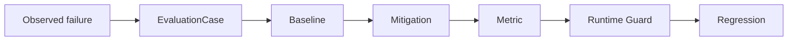

# LLM Evaluation Lab

**Reproducible LLM evaluation harness for failure mechanisms, mitigation experiments, and regression testing.**

[](https://github.com/aerenkolstein-code/llm-evaluation-lab/actions/workflows/test.yml)

## First Closed Loop

| Result | Measured value |
|---|---:|
| Baseline accuracy | 20% |
| With Closure Guard | 100% |
| Known regression failures caught | 4/4 |
| Evaluation tests | 22/22 |
| Executable MitigationSpec | Runtime-validated |

**Status:** Experimental / reproducible artifact  
**Evidence level:** E3 — reproducible public-safe evaluation



LLM Evaluation Lab proves whether a protection works. The paired [Companion-Mind](https://github.com/aerenkolstein-code/Companion-Mind) repository implements the protection.

`EVAL-CASE-001` reproduces **Premature Parent Closure** across five deterministic, public-safe variants. The harness compares a known-bad baseline with Companion-Mind's `CM-GUARD-001`, records metrics, and deliberately reintroduces the bad policy to prove the regression suite catches the recurrence.

> In the current reproducible first-closed-loop evaluation, the implemented Closure Guard improved the tested cases from 20% baseline accuracy to 100%; broader generalization has not yet been established.

## Historical Failure Benchmark v0.4

The second executable suite compresses longitudinal error observations into a
small mechanism benchmark without publishing the private source material or
encoding one rule per historical correction.

| Benchmark signal | Measured value |
|---|---:|
| Source observations reviewed | 89 |
| Raw failure categories | 18 |
| Mechanism clusters | 12 |
| Synthetic public-safe cases | 24 |
| Confidence-only baseline | 50% |
| Uniform constraint gate | 100% |
| Known-bad traps caught | 12/12 |
| Per-observation rules | 0 |

Each cluster contains a minimal pair: one fluent but structurally invalid `TRAP`
and one matched `CONTROL`. The reference gate accepts only supported candidates
whose explicit constraints all pass. It is the same policy for all 24 cases—there
are no mechanism-specific branches and no 89-item `if/else` table.

These figures describe a deterministic, mechanism-preserving synthetic benchmark.
They do not establish live-model effectiveness, corpus representativeness or
scientific benchmark validity.

## Reproduce

Clone both repositories as siblings. Requires Python 3.11 or later; no model API, network call, or private dataset is used by the experiment.

```bash
python -m pip install -e ../Companion-Mind
python -m pip install -e .
python -m unittest discover -s tests -v
llm-eval --cases cases/anonymized/premature-parent-closure.md
llm-eval \
  --cases cases/anonymized/premature-parent-closure.md \
  --emit-mitigation /tmp/mitigation.json \
  --output /tmp/evaluation.json
llm-eval \
  --suite historical \
  --cases cases/anonymized/premature-parent-closure.md \
  --output /tmp/historical-benchmark.json
companion-mind validate-mitigation --mitigation-spec /tmp/mitigation.json
```

The command validates the public-safe case contract, executes baseline and treatment,
grades every variant, calculates metrics, enforces the regression gate, and emits a
stable JSON or Markdown report. Exit code `1` means regression failure; invalid input
or missing runtime dependencies return `2`.

## Executable integration v0.3

The experiment now owns a complete `mitigation-spec/v1` contract, validates it,
emits canonical JSON, and instantiates Companion-Mind's real `ClosureGuard` from
that document. The evaluation report records the runtime-loaded mitigation ID,
safeguard ID, schema version, and canonical SHA-256 fingerprint. This makes the
boundary explicit: Eval Lab specifies and verifies; Companion-Mind implements.

## Evidence boundary

### Implemented

- dependency-free `llm-eval` CLI and deterministic evaluation harness;
- validated public-safe `EvaluationCase` loader;
- validated and emitted executable `MitigationSpec`;
- real Companion-Mind runtime loading with shared spec fingerprint;
- baseline and mitigation comparison;
- accuracy and premature-closure metrics;
- JSON and Markdown report output;
- checked result artifact and known-bad regression gate.
- validated 12-cluster, 24-case Historical Failure Benchmark;
- one uniform evidence-and-constraint gate with zero per-observation rules.

### Measured in the current demonstration

- baseline accuracy: **20%**;
- guarded accuracy: **100%**;
- premature closure rate: **100% → 0%**;
- known recurrence variants caught: **4/4**;
- evaluation tests: **15/15**;
- runtime integration status: **PASS**.
- historical benchmark baseline: **50%**;
- uniform constraint gate: **100%**;
- historical traps caught: **12/12**;
- evaluation tests: **22/22**.

### Not claimed

- production deployment;
- broad model generalization;
- scientific benchmark validity;
- enterprise-grade reliability;
- live-LLM effectiveness or statistical significance.

## Artifact map

- `evaluation_lab.py` — loader, policies, grader, metrics, regression gate, and CLI
- `cases/anonymized/premature-parent-closure.md` — first-loop case card plus executable 24-case historical benchmark
- `experiments/closure-guard-mitigation.md` — mitigation, decision rule, and executable JSON contract
- `results/EVAL-CASE-001.json` — checked deterministic result
- `tests/test_evaluation.py` — loader, reproducibility, reporting, and regression assertions
- `schemas/` — shared evaluation and mitigation contracts

## Roadmap

**Operationalization** — planned SQL/FastAPI/Docker, observability and experiment tracking after the current benchmark contract is stable.

## Privacy

The fixtures preserve failure mechanisms without publishing the private scenes that revealed them. The historical suite uses synthetic neutral scenarios and excludes source quotations and archive locators. The repository contains no private Raw/L0 material, credentials, account data, client documents, personal records, or links to private archives.
