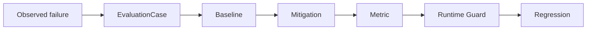

# LLM Evaluation Lab

**Reproducible LLM evaluation harness for failure mechanisms, mitigation experiments, and regression testing.**

[](https://github.com/aerenkolstein-code/llm-evaluation-lab/actions/workflows/test.yml)

## First Closed Loop

| Result | Measured value |
|---|---:|
| Baseline accuracy | 20% |
| With Closure Guard | 100% |
| Known regression failures caught | 4/4 |
| Evaluation tests | 4/4 |

**Status:** Experimental / reproducible artifact  
**Evidence level:** E3 — reproducible public-safe evaluation



LLM Evaluation Lab proves whether a protection works. The paired [Companion-Mind](https://github.com/aerenkolstein-code/Companion-Mind) repository implements the protection.

`EVAL-CASE-001` reproduces **Premature Parent Closure** across five deterministic, public-safe variants. The harness compares a known-bad baseline with Companion-Mind's `CM-GUARD-001`, records metrics, and deliberately reintroduces the bad policy to prove the regression suite catches the recurrence.

> In the current reproducible first-closed-loop evaluation, the implemented Closure Guard improved the tested cases from 20% baseline accuracy to 100%; broader generalization has not yet been established.

## Reproduce

Clone both repositories as siblings. Requires Python 3.11 or later; no model API, network call, or private dataset is used by the experiment.

```bash
python -m pip install -e ../Companion-Mind
python -m pip install -e .
python -m unittest discover -s tests -v
python evaluation_lab.py
```

## Evidence boundary

### Implemented

- deterministic evaluation harness;
- public-safe `EvaluationCase` fixture;
- baseline and mitigation comparison;
- accuracy and premature-closure metrics;
- checked result artifact;
- known-bad regression probe.

### Measured in the current demonstration

- baseline accuracy: **20%**;
- guarded accuracy: **100%**;
- premature closure rate: **100% → 0%**;
- known recurrence variants caught: **4/4**;
- evaluation tests: **4/4**.

### Not claimed

- production deployment;
- broad model generalization;
- scientific benchmark validity;
- enterprise-grade reliability;
- live-LLM effectiveness or statistical significance.

## Artifact map

- `evaluation_lab.py` — case, policies, metrics, and regression run
- `cases/anonymized/premature-parent-closure.md` — public-safe case card
- `experiments/closure-guard-mitigation.md` — mitigation and decision rule
- `results/EVAL-CASE-001.json` — checked deterministic result
- `tests/test_evaluation.py` — reproducibility and regression assertions
- `schemas/` — shared evaluation and mitigation contracts

## Roadmap

**Historical Failure Corpus** — planned expansion from longitudinal real-world LLM failure observations. It is intentionally out of scope for this release candidate.

## Privacy

The case preserves the failure mechanism without publishing the private scene that revealed it. The repository contains no private Raw/L0 material, credentials, account data, client documents, personal records, or links to private archives.

